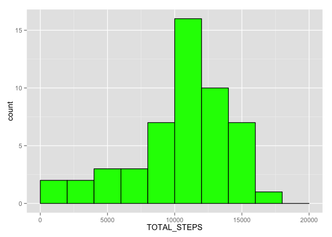
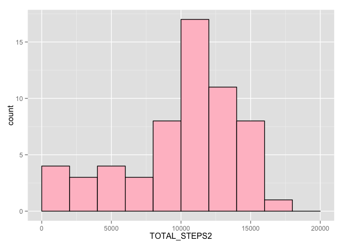
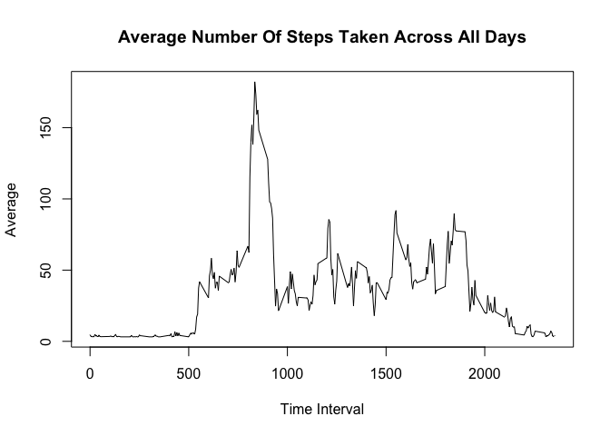
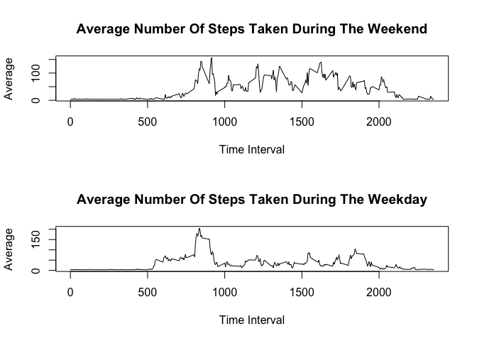

Course Project 1 - Reproducible Research 2016
====================================================================================
### 1. Code for reading in the dataset and/or processing the data

```r
library("dplyr")
```

```
## 
## Attaching package: 'dplyr'
## 
## The following objects are masked from 'package:stats':
## 
##     filter, lag
## 
## The following objects are masked from 'package:base':
## 
##     intersect, setdiff, setequal, union
```

```r
library(ggplot2)
```

```
## Warning: package 'ggplot2' was built under R version 3.1.3
```

```r
setwd("/Users/edwardha/Documents/COURSERA/Reproducible-Research")

DATA<-read.csv("activity.csv", header=TRUE,sep=",", na.strings="NA")
DATA2<-read.csv("activity.csv", header=TRUE,sep=",", na.strings="NA")
```


### 2 and 3. Total number of steps taken each day

```r
#Total number of steps taken per day
STEPS<-DATA%>%na.omit()%>%group_by(date)%>%summarise(TOTAL_STEPS=sum(steps),MEAN_STEPS=as.integer(mean(steps)),MEDIAN_STEPS=(median(steps)))
STEPS$TOTAL_STEPS<-as.numeric(STEPS$TOTAL_STEPS)

# 3. Mean and median number of steps taken each day
mean(STEPS$TOTAL_STEPS)
```

```
## [1] 10766.19
```

```r
median(STEPS$TOTAL_STEPS)
```

```
## [1] 10765
```


```r
# 2. Histogram of the total number of steps taken each day
m<-ggplot(STEPS,aes(x=TOTAL_STEPS))
m+geom_histogram(breaks=seq(0,21200,by=2000),col="black",fill="green")
```

 

### 6. Code to describe and show a strategy for imputing missing data
The strategy is to replace NA with average steps using loops as shown in the code.

```r
# 6. Code to describe and show a strategy for imputing missing data
#Replace NA with average steps
#First loop is to average # of steps on days when there is a mix of NA and steps.
#Second loop is to average # of steps on days when there is only NA.  No average possible and therefore will assign a 0
#DATA2 are the filled-in data

rowtot<-nrow(DATA2)
for (i in 1:rowtot) {
  if (is.na(DATA2$steps[i])==TRUE) {DATA2$steps[i]=STEPS[DATA2$date[i],3]}
}

for (i in 1:rowtot) {
  if (is.na(DATA2$steps[i])==TRUE) {DATA2$steps[i]=0}
}

#Total number of steps taken per day
STEPS2<-DATA2%>%na.omit()%>%group_by(date)%>%summarise(TOTAL_STEPS2=sum(steps),MEAN_STEPS2=as.integer(mean(steps),MEDIAN_STEPS2=(median(steps))))
STEPS2$TOTAL_STEPS2<-as.numeric(STEPS2$TOTAL_STEPS2)
STEPS2$date<-as.Date(STEPS2$date) #Transform to date format
```

### 7. Histogram of the total number of steps taken each day after missing values are imputed

```r
# 7. Histogram of the total number of steps taken each day with no missing values
n<-ggplot(STEPS2,aes(x=TOTAL_STEPS2))
n+geom_histogram(breaks=seq(0,21200,by=2000),col="black",fill="pink")
```

 


```r
STEPS2$WEEKDAY<-weekdays(STEPS2$date) #Weekdays to find out if falls on Saturday or Sunday
```


The overall pattern of the histograms did not change.  The green histogram (N/A ignored) and pink histogram (average value of N/A) will have slightly different values given that the calculation is different.  But the overall pattern did not change drastically. 


```r
#Calculate the number of mssing values
MISSING_VALUES<-sum(is.na(DATA$steps))
MISSING_VALUES
```

```
## [1] 2304
```

### 4. and 5. Time series plot of the average number of steps taken

```r
PLOT_DATA<-DATA2%>%group_by(interval)%>%summarise(MEAN_EACHINTERVAL=mean(steps))
plot(PLOT_DATA$interval,PLOT_DATA$MEAN_EACHINTERVAL,type="l",xlab="Time Interval",ylab="Average",main="Average Number Of Steps Taken Across All Days")
```

 

```r
## 5. The 5-minute interval that, on average, contains the maximum number of steps
RESULT<-PLOT_DATA[PLOT_DATA$MEAN_EACHINTERVAL==max(PLOT_DATA$MEAN_EACHINTERVAL),]
RESULT$interval
```

```
## [1] 835
```
The 5 min interval that, on average contains the maximum number of steps is 835

### 8. Panel plot comparing the average number of steps taken per 5-minute interval across weekdays and weekends

```r
#Determine if days are weekdays or weekends
weekdays1<-c('Monday', 'Tuesday', 'Wednesday', 'Thursday', 'Friday')
STEPS2$wDAY<-factor((STEPS2$WEEKDAY %in% weekdays1), levels=c(FALSE, TRUE), labels=c('weekend', 'weekday'))

#Do the same thing for DATA3 and determine weekdays or weekends
#STEP1:  Create a DATA3
DATA3<-DATA2
#STEP2:  Transform date into a date format and add a new field that displays weekday or weekend.
DATA3$date2=as.Date(DATA3$date)
DATA3$WEEKDAY<-weekdays(DATA3$date2) #Weekdays to find out if falls on Saturday or Sunday
DATA3$wDAY<-factor((DATA3$WEEKDAY %in% weekdays1), levels=c(FALSE, TRUE), labels=c('weekend', 'weekday'))
#STEP2:  Select only weekdays 
WEEKDAY<-DATA3%>%filter(wDAY=="weekday")
WEEKEND<-DATA3%>%filter(wDAY=="weekend")
#STEP3: Average weekdays
par(mfrow=c(2,1))
PLOT_WEEKEND<-WEEKEND%>%group_by(interval)%>%summarise(MEAN_EACHINTERVAL1=mean(steps))
plot(PLOT_WEEKEND$interval,PLOT_WEEKEND$MEAN_EACHINTERVAL1,type="l",xlab="Time Interval",ylab="Average",main="Average Number Of Steps Taken During The Weekend")

PLOT_WEEKDAY<-WEEKDAY%>%group_by(interval)%>%summarise(MEAN_EACHINTERVAL2=mean(steps))
plot(PLOT_WEEKDAY$interval,PLOT_WEEKDAY$MEAN_EACHINTERVAL2,type="l",xlab="Time Interval",ylab="Average",main="Average Number Of Steps Taken During The Weekday")
```

 

##The end
